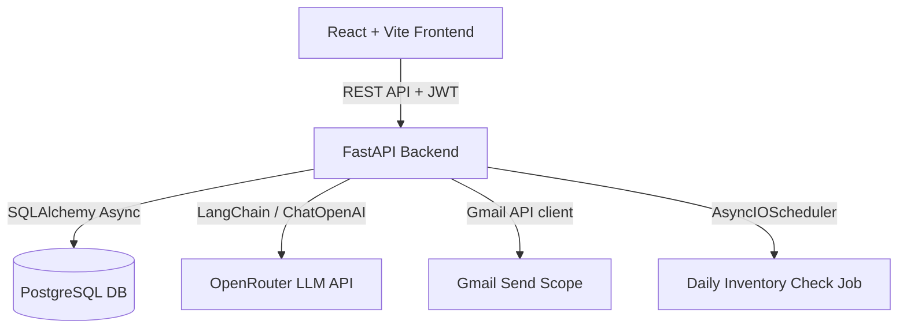

<<<<<<< HEAD
# AI-Based Smart Inventory & Automated Supplier Reordering System

A complete production-quality smart inventory dashboard featuring automated days-remaining calculations, FEFO batch expiry rules, custom reorder formulas, open-source AI email drafting via OpenRouter + LangChain, human-in-the-loop email approval workflow, and SMTP/OAuth2 sending via the Gmail API.

---

## 🏗️ Architecture & Technology Stack



### 1. Backend (FastAPI + SQLAlchemy)
- **FastAPI**: Asynchronous routing, robust dependency injection, Pydantic v2 schemas.
- **SQLAlchemy (Async)**: Eager relations, clean transactions, FEFO batch querying.
- **Alembic**: Full database schema migration script pipeline.
- **APScheduler**: Periodic cron execution of the daily inventory monitor.

### 2. Frontend (React + Vite + Recharts)
- **Vite + React**: Single Page Application, proxy rules, fast hot-reloads.
- **Recharts**: High-performance SVG analytics data visualization.
- **Custom CSS Design**: Dark-mode glassmorphism theme, premium responsive design, status badges, and subtle hover animations.

### 3. AI & Communication Services
- **LangChain + OpenRouter**: Email drafted by LLM with zero access to business variables or decisions.
- **Gmail API OAuth2**: Custom script to consent sending emails via Gmail securely.

---

## ⚡ Quickstart Guide

### Prerequisites
- Node.js (v20+)
- Python (3.12+)
- Docker & Docker Compose (optional)

### 1. Backend Setup & Seeding
```bash
cd backend
python -m venv .venv
source .venv/bin/activate  # On Windows: .venv\Scripts\activate

# Install requirements
pip install -r requirements.txt aiosqlite email-validator

# Copy .env file and update configuration keys
cp .env.example .env

# Run migrations
alembic upgrade head

# Seed demo data (contains products in low/critical/out of stock and expiry soon conditions)
python scripts/seed_data.py

# Launch development server
uvicorn app.main:app --reload
```

### 2. Frontend Setup
```bash
cd frontend
npm install
npm run dev
```
Open [http://localhost:5173](http://localhost:5173) in your browser.

---

## 🔑 Demo Credentials
- **Admin Role**: `admin@inventory.com` / `Admin@1234`
- **Manager Role**: `manager@inventory.com` / `Manager@1234`

---

## 🧪 Running Tests
The test suite utilizes in-memory SQLite (`aiosqlite`) to test endpoints, authorization rules, business calculations, and API models with fully mock-isolated integrations.
```bash
cd backend
pytest -v
```

---

## 🐳 Docker Deployment
To deploy the entire production environment:
```bash
docker-compose up --build
```
- Frontend: `http://localhost:5173`
- Backend docs: `http://localhost:8000/docs`
=======
# React + Vite

This template provides a minimal setup to get React working in Vite with HMR and some Oxlint rules.

Currently, two official plugins are available:

- [@vitejs/plugin-react](https://github.com/vitejs/vite-plugin-react/blob/main/packages/plugin-react) uses [Oxc](https://oxc.rs)
- [@vitejs/plugin-react-swc](https://github.com/vitejs/vite-plugin-react/blob/main/packages/plugin-react-swc) uses [SWC](https://swc.rs/)

## React Compiler

The React Compiler is not enabled on this template because of its impact on dev & build performances. To add it, see [this documentation](https://react.dev/learn/react-compiler/installation).

## Expanding the Oxlint configuration

If you are developing a production application, we recommend using TypeScript with type-aware lint rules enabled. Check out the [TS template](https://github.com/vitejs/vite/tree/main/packages/create-vite/template-react-ts) for information on how to integrate TypeScript and Oxlint's TypeScript related rules in your project.
>>>>>>> a630576 (frontend folder)
